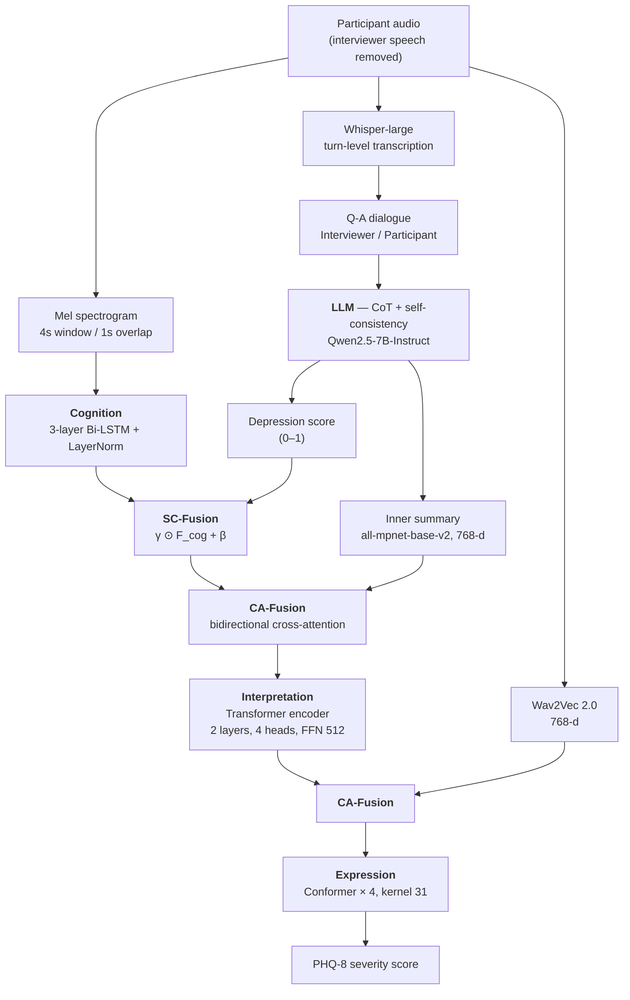

# CIEDep-Net

**Hierarchical Modeling of Human Language Processing with Large Language Model for Multimodal Depression Detection**

Official implementation of **CIEDep-Net** (Cognition–Interpretation–Expression Depression Network), a multimodal framework that predicts PHQ-8 depression severity by functionally modeling the three stages of human language processing.

State : Under review

---

## Abstract

Depression severely impacts quality of life, making accurate early diagnosis crucial for mitigating long-term consequences. Previous studies have leveraged audio and text but typically treat them in isolation, overlooking the cognition-interpretation-expression processes underlying conversation. We present the Cognition-Interpretation-Expression Depression Network (CIEDep-Net), a multimodal framework that functionally models this three-stage structure. Each stage analyzes inputs with features tailored to its role, and a strategy combining score-conditioned fusion and cross-attention captures inter-stage interactions. In the interpretation stage, a large language model equipped with Chain-of-Thought prompting and a self-consistency strategy is used to generate depression scores and an inner summary from the interview transcript. The generated outputs show statistically significant agreement with the ground-truth data (Pearson correlation coefficient, r = 0.69, p < 0.01, BERTScore = 0.8), supporting the predictive validity of the proposed approach. CIEDep-Net achieved MAE 1.98, CCC 0.884 on DAIC-WOZ, and MAE 2.72, CCC 0.78 on E-DAIC, a 4.56% MAE reduction over the strongest prior multimodal baseline. Ablations confirm that removing any stage degrades performance, underscoring complementary contributions of cognition, interpretation, and expression. By embedding human language processing mechanisms into multimodal learning, CIEDep-Net delivers reliable, consistent depression-severity prediction across datasets. The approach suggests a pathway toward clinically meaningful and scalable assessment through the integrating of linguistic and paralinguistic cues.

---

## Overview

Most audio–text approaches to depression detection treat the two modalities as co-occurring but functionally independent signals. CIEDep-Net instead follows the *speech chain*: speech is **perceived** (cognition), its content is **interpreted** (interpretation), and an internal state is **expressed** (expression). Each stage receives the feature best suited to its functional role, and the stages are chained by two fusion modules.



**Three stages**

| Stage | Input | Backbone | Role |
|---|---|---|---|
| Cognition | Mel spectrogram (80-bin) | 3-layer Bi-LSTM + LayerNorm (64→128→256, bidirectional) | Phoneme/syllable → word → sentence-level auditory perception |
| Interpretation | Interview transcript → LLM depression score + inner summary | Transformer encoder (2 layers, 4 heads, FFN 512) | Semantic and cognitive bias, internal state |
| Expression | Wav2Vec 2.0 (768-d) | Conformer (4 layers, 4 heads, kernel 31, Macaron FFN) | Speaking rate, intonation, temporal dynamics |

**Two fusion modules**

- **SC-Fusion** (score-conditioned, Eq. 5–7) — the LLM depression score conditions the cognition sequence: `γ = σ(F_score W_γ + b_γ)`, `β = F_score W_β + b_β`, `F_CI1 = γ ⊙ F_cog + β`.
- **CA-Fusion** (cross-attention, Eq. 8–12) — bidirectional cross-attention between a main feature and an auxiliary feature, concatenated, passed through a gating network, then a residual + LayerNorm.

---

## Results

Reported in the paper. Mean ± std over 5-fold cross-validation.

**Main comparison (DAIC-WOZ)**

| Model | Hierarchical | Fusion | CCC ↑ | MAE ↓ | RMSE ↓ | r ↑ |
|---|:---:|---|---|---|---|---|
| Baseline 1 (parallel late fusion) | ✗ | Late | 0.755 ± 0.036 | 3.06 ± 0.20 | 4.05 ± 0.22 | 0.809 |
| Baseline 2 (early-fusion Conformer) | ✗ | Early | 0.862 ± 0.018 | 2.24 ± 0.09 | 3.15 ± 0.22 | 0.889 |
| Baseline 3 (simple concat fusion) | ✓ | Concat | 0.800 ± 0.037 | 2.50 ± 0.16 | 3.57 ± 0.22 | 0.850 |
| Baseline 4 (Transformer expression) | ✓ | SC/CA | 0.880 ± 0.013 | 2.13 ± 0.12 | 2.89 ± 0.17 | 0.900 |
| **CIEDep-Net (proposed)** | ✓ | SC/CA | **0.884 ± 0.004** | **1.98 ± 0.03** | **2.78 ± 0.08** | **0.906** |

**Stage ablation (DAIC-WOZ)**

| Configuration | Modality | CCC ↑ | MAE ↓ | RMSE ↓ | r ↑ |
|---|:---:|---|---|---|---|
| Cognition only | A | 0.765 ± 0.260 | 2.73 ± 0.10 | 3.71 ± 0.12 | 0.805 |
| Interpretation only | T | 0.720 ± 0.006 | 3.12 ± 0.07 | 4.05 ± 0.05 | 0.750 |
| Expression only | A | 0.702 ± 0.047 | 3.23 ± 0.28 | 4.15 ± 0.16 | 0.805 |
| w/o Cognition | AT | 0.862 ± 0.017 | 2.32 ± 0.13 | 3.08 ± 0.14 | 0.901 |
| w/o Interpretation | A | 0.690 ± 0.062 | 3.02 ± 0.39 | 4.14 ± 0.25 | 0.790 |
| w/o Expression | AT | 0.860 ± 0.010 | 2.23 ± 0.14 | 2.94 ± 0.15 | 0.902 |
| w/o depression score | AT | 0.741 ± 0.021 | 2.74 ± 0.05 | 3.81 ± 0.74 | 0.814 |
| w/o inner summary | AT | 0.873 ± 0.009 | 2.01 ± 0.04 | 2.87 ± 0.07 | 0.890 |
| **CIEDep-Net** | AT | **0.884 ± 0.004** | **1.98 ± 0.03** | **2.78 ± 0.08** | **0.906** |

**Cross-dataset**

| Dataset | Participants | Samples after augmentation | CCC ↑ | MAE ↓ |
|---|---|---|---|---|
| DAIC-WOZ | 186 | 387 | 0.884 | 1.98 |
| E-DAIC | 275 | 567 | 0.780 | 2.72 |

**LLM interpretation validity** — generated depression scores agree with ground-truth PHQ-8 at *r* = 0.69 (*p* < 0.01); inner summaries reach BERTScore = 0.8 against the participant's own utterances.

---

## Repository structure

```
CIEDep-Net/
├── configs/
│   ├── daic_woz.yaml            # all paths + hyperparameters for DAIC-WOZ
│   └── e_daic.yaml              # same for E-DAIC
├── scripts/                     # numbered, run in order
│   ├── 00_migrate_legacy.py     # (optional) reuse features/LLM outputs you already have
│   ├── 01_build_dataset.py      # participant-only audio from transcript timings
│   ├── 02_augment.py            # pitch shift / time stretch on minority classes
│   ├── 03_transcribe.py         # turn splitting + Whisper -> Q-A dialogue
│   ├── 04_llm_interpretation.py # CoT + self-consistency -> score & inner summary
│   ├── 05_extract_features.py   # mel (cognition) + SSL audio (expression)
│   ├── 06_train.py              # 5-fold cross-validation
│   ├── 07_evaluate.py           # test-set metrics + plots
│   └── 08_llm_validity.py       # LLM score vs. PHQ-8, BERTScore
├── src/ciedep/
│   ├── config.py  utils.py  metrics.py  pipeline.py  train.py
│   ├── data/       # participant_audio, turns, augment, labels, dataset
│   ├── features/   # segment, mel, ssl_audio, text_embed
│   ├── llm/        # transcribe, prompts, generate, self_consistency, parse
│   ├── models/     # cognition, interpretation, expression, conformer, fusion, ciedep_net
│   └── analysis/   # llm_validity, plots
└── notebooks/
    └── demo_reproduce.ipynb     # end-to-end walkthrough
```

Every path and hyperparameter lives in `configs/*.yaml`. No path is hard-coded in the source.

---

## Installation

```bash
git clone https://github.com/<your-account>/CIEDep-Net.git
cd CIEDep-Net
python -m venv .venv && source .venv/bin/activate   # Windows: .venv\Scripts\activate
pip install -r requirements.txt
```

Paper environment: Python 3.12, PyTorch 2.6, CUDA 12.8, cuDNN, a single NVIDIA H100 (80 GB). Install the GPU build of PyTorch from [pytorch.org](https://pytorch.org) for your CUDA version. The code also runs on smaller GPUs — reduce `train.batch_size` in the config if you hit out-of-memory.

For gated Hugging Face models, export a token instead of writing it in code:

```bash
export HF_TOKEN=hf_xxxxxxxxxxxx    # Windows PowerShell: $env:HF_TOKEN="hf_xxx"
```

---

## Datasets

CIEDep-Net is evaluated on **DAIC-WOZ** and **E-DAIC**, distributed by USC ICT under a license agreement. Request access at <https://dcapswoz.ict.usc.edu/>.

**No audio, transcript, or PHQ-8 label from these corpora is included in this repository**, and `.gitignore` is set up to keep them out. After obtaining the data, point `configs/*.yaml` at your local copy:

```yaml
dataset:
  raw_dir: "/path/to/DAIC-WOZ"        # <ID>_P/ folders with AUDIO.wav + TRANSCRIPT.csv
  label_csv: "/path/to/labels.csv"    # Participant_ID, PHQ8_Score, 3 Class
paths:
  participant_dir: "/path/to/participant_only_audio"
  feature_dir:     "/path/to/features"
  llm_dir:         "/path/to/llm_outputs"
```

Three DAIC-WOZ participants are excluded because of missing interviewer transcripts (189 → 186), matching the paper; the excluded row indices are in `dataset.excluded_indices`.

---

## Reproducing the pipeline

Run the scripts in order. Each takes `--config`, so the same commands work for both datasets.

### 1. Build the dataset

Extracts participant speech using the transcript timings and concatenates it into one file per participant. All interviewer speech is removed to avoid bias.

```bash
python scripts/01_build_dataset.py --config configs/daic_woz.yaml
```

### 2. Augment the minority classes

PHQ-8 is binned into non-depressed (0–9), moderate (10–14), and severe (15–24). Only moderate and severe are augmented, with pitch shift (±3 semitones) and time stretch (0.85–1.15×). Time shift is deliberately not used — it distorts the temporal order the model relies on.

```bash
python scripts/02_augment.py --config configs/daic_woz.yaml
```

DAIC-WOZ: +99 moderate, +102 severe → 387 samples. E-DAIC: +146 each → 567 samples (189 per class).

### 3. Transcribe into a Q-A structure

Defines a speaker turn as the span from one speaker's first utterance to the other speaker's next one, merges the utterance segments into a single clip per turn, transcribes each with Whisper-large, and labels the lines `Interviewer:` / `Participant:`.

```bash
python scripts/03_transcribe.py --config configs/daic_woz.yaml
python scripts/03_transcribe.py --config configs/daic_woz.yaml --use-reference-text   # skip Whisper
```

### 4. LLM interpretation

Generates a depression score and a first-person inner summary with CoT prompting and self-consistency (5 samples, temperature 0.8, top-p 0.9, max 1024 tokens). The score is the mean of the 5 values; the summary is the sample whose embedding is closest to the mean embedding.

```bash
python scripts/04_llm_interpretation.py --config configs/daic_woz.yaml
python scripts/04_llm_interpretation.py --config configs/daic_woz.yaml --strategy standard   # Table II
```

Strategies: `standard`, `cot`, `cot_self_consistency` (default), `cot_self_validation`.

### 5. Extract features

```bash
python scripts/05_extract_features.py --config configs/daic_woz.yaml --kind mel
python scripts/05_extract_features.py --config configs/daic_woz.yaml --kind wav2vec2
```

Both use a 4 s window with 1 s overlap. Mel features are averaged over time per segment and min-max normalized per participant; SSL features are the frame-mean of `last_hidden_state`. Other SSL encoders (`hubert`, `wavlm`, `unispeech_sat`) and other window lengths (`--window 10`) reproduce Table I.

### 6. Train

```bash
python scripts/06_train.py --config configs/daic_woz.yaml
python scripts/06_train.py --config configs/e_daic.yaml
```

20 % of samples are held out for testing; the remaining 80 % is split 5 ways with `StratifiedKFold` on the PHQ-8 class. Huber loss, AdamW (lr 1e-4, weight decay 5e-5), 10-epoch warm-up then cosine annealing, early stopping with patience 15, seed 128.

### 7. Evaluate

```bash
python scripts/07_evaluate.py --config configs/daic_woz.yaml --plots
```

Writes MAE / RMSE / CCC / *r* / R² per fold plus a scatter plot, score distribution, and confusion matrix.

### 8. Validate the LLM outputs

```bash
python scripts/08_llm_validity.py --config configs/daic_woz.yaml --bertscore --plot
```

---

## Ablation studies

All configurations in Tables III and IV are reachable through flags on `06_train.py`:

```bash
python scripts/06_train.py --config configs/daic_woz.yaml --tag wo_score       --no-score
python scripts/06_train.py --config configs/daic_woz.yaml --tag wo_summary     --no-summary
python scripts/06_train.py --config configs/daic_woz.yaml --tag wo_cognition   --no-cognition
python scripts/06_train.py --config configs/daic_woz.yaml --tag wo_interp      --no-interpretation
python scripts/06_train.py --config configs/daic_woz.yaml --tag wo_expression  --no-expression
python scripts/06_train.py --config configs/daic_woz.yaml --tag baseline3      --fusion concat
python scripts/06_train.py --config configs/daic_woz.yaml --tag baseline4      --expression-backbone transformer
```

Results are written to `<result_dir>/<tag>.json`.

Removing a stage changes what feeds the main path: without cognition, the Wav2Vec 2.0 sequence is projected and becomes the main path; without interpretation, SC-Fusion and the summary CA-Fusion are skipped; without expression, the final CA-Fusion is skipped and the Conformer runs directly on the interpretation output. The proposed configuration is the one reported in the paper; ablation variants follow the definitions in Table III rather than the exact hand-edited notebooks used during the original experiments.

---

## Reusing features you already have

If you have already extracted features or LLM outputs on a GPU, convert them instead of recomputing:

```bash
python scripts/00_migrate_legacy.py --config configs/daic_woz.yaml \
    --legacy-feature /path/to/wav2vec2_features.pkl --kind wav2vec2 \
    --legacy-llm-score /path/to/Qwen2.5-7B-Instruct_score.pkl \
    --legacy-llm-summary /path/to/Qwen2.5-7B-Instruct_summary.pkl \
    --legacy-llm-embedding /path/to/Qwen2.5-7B-Instruct_summary_embedding.pkl
```

It converts the `{'Non_depression': [...], 'Moderate': [...], 'Severe': [...]}` layout to `{sample_id: array}` and the participant-ordered LLM lists to `{participant_id: value}`, and fails loudly if the file counts do not line up with the directories in the config.

---

## Configuration

`configs/*.yaml` is grouped by concern:

| Section | Contents |
|---|---|
| `dataset` | Corpus paths, transcript column names, label columns, excluded participants |
| `paths` | Derived artifacts: participant audio, augmentation, features, LLM outputs, checkpoints, results |
| `audio` | Sample rate, 4 s window / 3 s hop, 80 mel bins, 25 ms / 10 ms frames, `pad_length` (227 / 159) |
| `augment` | PHQ-8 bins, pitch and stretch ranges, per-class sample counts |
| `llm` | Model id, prompt strategy, self-consistency samples, decoding parameters, sentence embedder |
| `features` | Expression encoder choice and Hugging Face model ids, Whisper size |
| `model` | Stage dimensions and depths |
| `train` | Seed, folds, batch size, optimizer, scheduler, early stopping |

---

---

## Intended use

This is research code for depression-severity estimation on a benchmark corpus. It is **not** a diagnostic tool and must not be used for clinical decisions about any individual. Depression diagnosis requires assessment by a qualified mental health professional.

---

